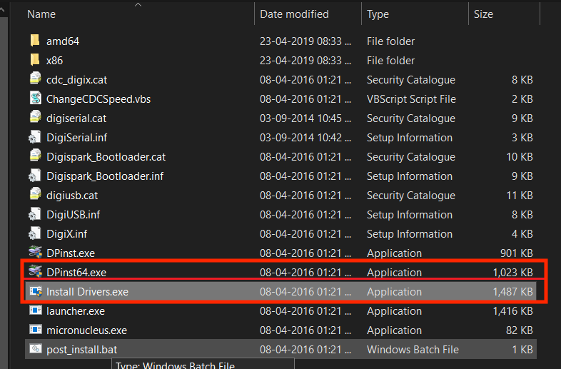

# ATtiny85-Digispark

Voici la procédure complète pour configurer et utiliser un ATtiny85-Digispark :

1. télécharger la version Microsoft Store de Arduino (version 1.8.19)

2. télécharger les pilotes nécessaires :

    Une fois le pilote téléchargé, extrayez le fichier zip et exécutez les fichier "Install Drivers.exe" et "DPinst64.exe", dans cet ordre.
    

3. 

Dans l'ide arduino, dans "préférences", coller la ligne suivante :

"https://raw.githubusercontent.com/digistump/arduino-boards-index/master/package_digistump_index.json".

Aide : https://projecthub.arduino.cc/alaspuresujay/use-an-attiny85-with-arduino-ide-d847c5

L’USB Rubber Ducky est un dispositif génial pour les tests de pénétration et les méfaits en général. Alors qu’il semble s’agir d’une clé USB inoffensive, lorsqu’il est branché sur un ordinateur, il s’enregistre comme un clavier USB sur le système et envoie une charge utile de frappe à la vitesse de l’éclair. Nous allons utiliser cette rubber ducky achetée sur AliExpress pour 2€

Comment ça marche ?
Programmation : Le Rubber Ducky a besoin d’être programmée avant utilisation. On lui injecte un script spécial, écrit dans un langage appelé Ducky Script. Ce script définit toutes les actions que le Rubber Ducky simulera une fois branchée.

HID et frappe clavier : Une fois branchée sur un ordinateur, le Rubber Ducky se présente comme un clavier (HID - Human Interface Device). L’ordinateur ne se doute de rien et la traite comme un périphérique d’entrée classique.

Exécution du script : Le programme interne du Rubber Ducky lit le script injecté. Celui-ci peut contenir des frappes clavier à vitesse folle, allant bien au-delà de ce qu’un humain peut taper. Le script peut aussi inclure des combinaisons de touches spéciales ou des commandes pour exécuter des programmes.

tuto d’installation
Une fois après avoir reçu votre carte ATtiny85 Digispark, je n’ai pas pu l’utiliser pendant deux jours simplement à cause des pilotes. Du coup nous allons installer les pilotes pour la carte ATtiny85 Digispark!

Étape 1 : Installer le pilote Windows pour ATtiny85.
Téléchargez le pilote Windows pour ATtiny85 Digispark en cliquant sur pilote.

Une fois le pilote téléchargé, extrayez le fichier zip et exécutez les fichier Install Drivers.exe et DPinst64.exe. et exécutez le fichier Install drivers.exe (pour les systèmes d’exploitation 64 bits)

arduino

Étape 2 : Installer les packages de carte pour Arduino.
arduino

arduino

Copiez l’URL suivante : https://raw.githubusercontent.com/digistump/arduino-boards-index/master/package_digistump_index.json

Collez cette URL dans le menu “Fichier > Préférences > URL supplémentaire du gestionnaire de cartes” dans votre IDE Arduino.

Ensuite, dans le menu “Outils”, sélectionnez “Gestionnaire de cartes”, puis choisissez “Contribué” dans le menu déroulant “Type”.

Recherchez et sélectionnez le package “Digistump AVR Boards”, puis cliquez sur le bouton “Installer”. Vous pourrez suivre la progression du téléchargement dans la barre de statut en bas de la fenêtre du “Gestionnaire de cartes”. Une fois l’installation terminée, il affichera “Installé” à côté de cet élément dans la liste.

Pour les utilisateurs de Windows, une fois l’installation terminée, une fenêtre d’Assistant d’installation de pilotes s’ouvrira. Cliquez sur “Suivant” dans cette fenêtre pour installer les pilotes pour les cartes Digistump. Si vous avez déjà ces pilotes installés, cet installateur les mettra à jour et installera ceux qui manquent.

Après l’installation, fermez la fenêtre du “Gestionnaire de cartes” et sélectionnez le Digispark dans le menu “Outils > Cartes” de votre IDE Arduino. “Digispark (Par défaut - 16.5mhz)” est la carte recommandée pour tous les nouveaux utilisateurs.

Pour les utilisateurs Linux, si ce n’est pas déjà fait, veuillez installer les règles udev disponibles dans la section de dépannage.

Une fois ces étapes terminées, l’installation est maintenant complète et vous pouvez commencer à utiliser votre Digispark.

Étape 3 : Comment télécharger le programme
arduino

arduino

arduino

Le Digispark fonctionne un peu différemment de certains produits compatibles Arduino. Le Digispark se programme selon une procédure différente. Dans le menu Outils, sélectionnez Carte → Digispark (Par défaut - 16.5Mhz). Écrivez du code, ouvrez votre code.

Vous n’avez pas besoin de brancher votre Digispark avant d’effectuer le téléversement. Appuyez sur le bouton de téléversement. La boîte de statut en bas vous demandera maintenant de brancher votre Digispark - à ce stade, vous devez le brancher - ou le débrancher et le rebrancher.

Vous verrez la progression du téléversement, puis votre code s’exécutera immédiatement sur le Digispark. Si vous débranchez le Digispark et le rebranchez ou si vous le connectez à une autre source d’alimentation, il y aura un délai de 5 secondes avant que le code que vous avez programmé ne s’exécute. Ce délai de 5 secondes correspond au Digispark Pro vérifiant si vous essayez de le programmer.

Code d’exemple
Nous devons écrire les commande en QWERTY pour que le Rubber Ducky puisse les comprendre :

#include <DigiKeyboard.h>

void setup() {
   DigiKeyboard.delay(3000); // Attendre 3 secondes

   DigiKeyboard.sendKeyStroke(KEY_R, MOD_GUI_LEFT); // Ouvrir une fenêtre d'exécution Windows
   DigiKeyboard.delay(500); // Attendre 0,5 seconde
   DigiKeyboard.print("c;d"); // Écrire "cmd"
   DigiKeyboard.delay(500); // Attendre 0,5 seconde
   DigiKeyboard.sendKeyStroke(KEY_ENTER);
}

void loop() {
  // put your main code here, to run repeatedly:

}
Conclusion
Le Rubber Ducky, bien qu’amusant en apparence, est un outil puissant et versatile dans le domaine de la sécurité informatique. Sa simplicité d’utilisation et son aspect discret en font un atout précieux pour les tests d’intrusion et les démonstrations de sécurité.

Points clés à retenir :

Facilité d’utilisation : Programmation simple avec Ducky Script, accessible aux débutants. Polyvalence : Large éventail d’applications, des tests d’intrusion aux présentations éducatives. Discrétion : Aspect anodin d’une clé USB ordinaire pour une infiltration discrète. Efficacité : Permet de simuler des frappes clavier à grande vitesse et d’exécuter des commandes complexes.

Recommandations :

Utiliser le Rubber Ducky de manière responsable : Ne pas l’utiliser pour des activités malveillantes. Se familiariser avec les risques de sécurité : Comprendre les implications et les dangers potentiels. Mettre en place des mesures de sécurité adéquates : Protéger vos systèmes contre les attaques utilisant des Rubber Duckies.

Sources
https://projecthub.arduino.cc/

https://fr.aliexpress.com/

https://www.youtube.com/